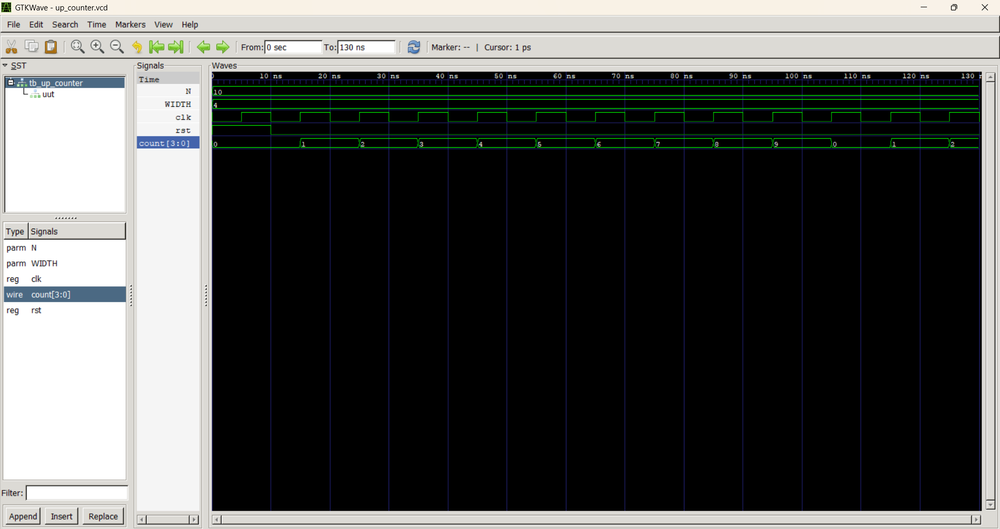
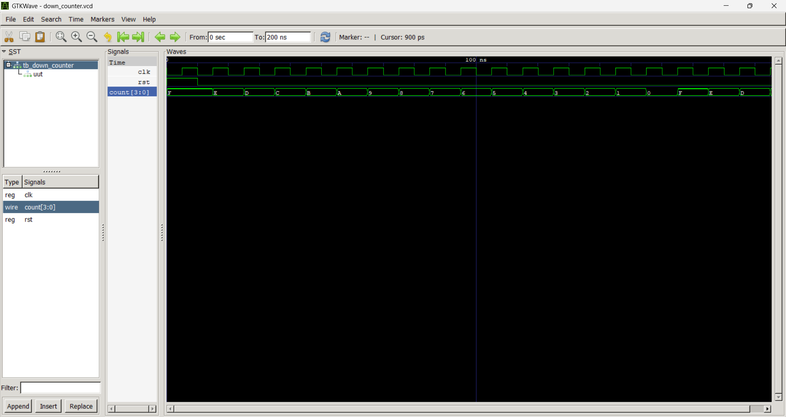
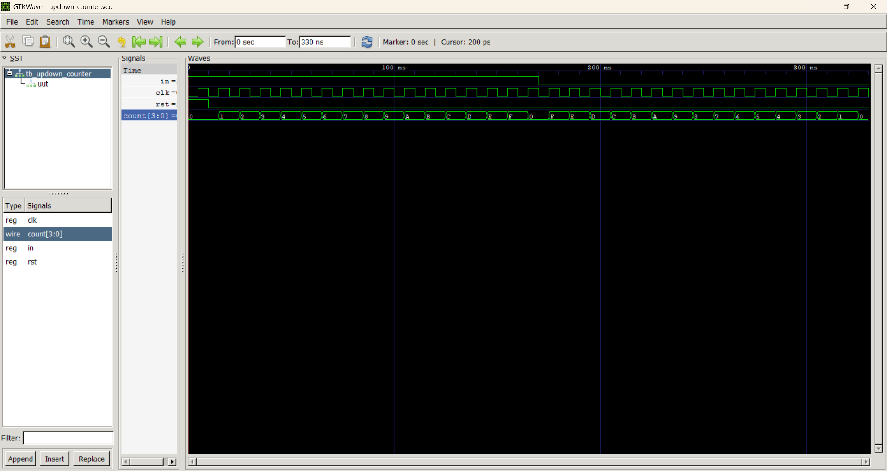
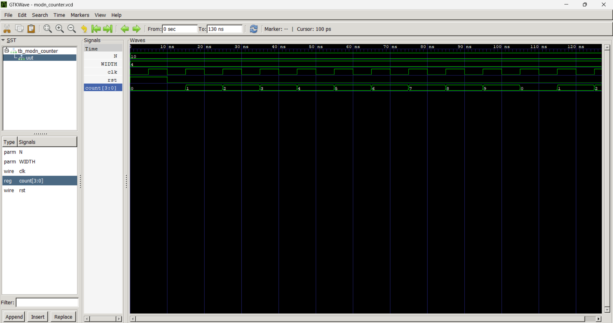
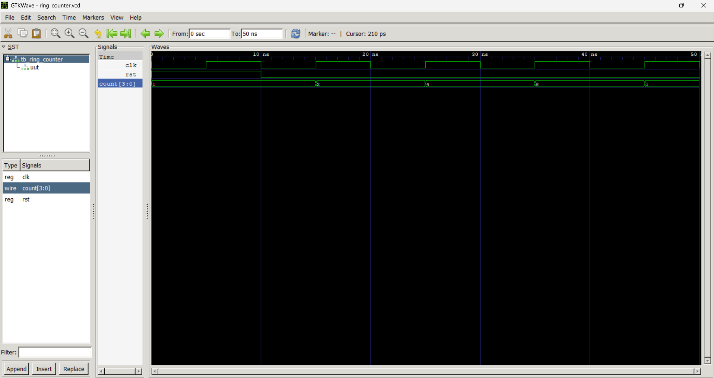
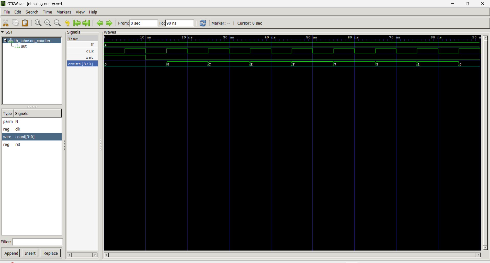

# Counters in Verilog HDL

## Overview

This project implements different types of counters using Verilog HDL. Each counter is verified using an independent testbench and simulated using Icarus Verilog and GTKWave.

## Counters Included

### Up Counter
Increments its count by one on every rising edge of the clock until the maximum count is reached, then wraps around to zero.

### Down Counter
Decrements its count by one on every rising edge of the clock until zero is reached, then wraps around to the maximum count.

### Up/Down Counter
Can operate as either an up counter or a down counter based on a control signal, providing flexible counting functionality.

### Mod-N Counter
Counts from 0 to N−1 and automatically resets to 0 after reaching the specified modulus.

### Ring Counter
A shift register-based counter in which a single logic '1' circulates through all flip-flops, creating a repeating sequence.

### Johnson Counter
A modified ring counter where the inverted output of the last flip-flop is fed back to the first, producing twice as many unique states as the number of flip-flops.

## Applications

- Event Counting
- Digital Timers
- Frequency Measurement
- Sequence Generation
- Digital Control Systems

## Tools Used

- Verilog HDL
- VS Code
- Icarus Verilog
- GTKWave

## Project Structure

- RTL Design Files
- Testbench Files
- Simulation Waveforms

## Learning Outcomes

- Sequential Logic Design
- Counter Design
- Verilog RTL Coding
- Testbench Development
- Functional Simulation

## Simulation Results

### Up Counter

The waveform below shows the counter incrementing its value by one on every rising edge of the clock.

### Down Counter

The waveform demonstrates the counter decrementing its value by one on each rising edge of the clock.

### Up/Down Counter

The waveform shows the counter incrementing or decrementing based on the value of the direction control signal.

### Mod-N Counter

The waveform verifies that the counter resets to zero after reaching the specified modulus (N−1).

### Ring Counter

The waveform illustrates a single logic '1' circulating through the flip-flops in a repeating sequence.

### Johnson Counter

The waveform shows the twisted ring counter sequence generated by feeding back the inverted output of the last flip-flop.

