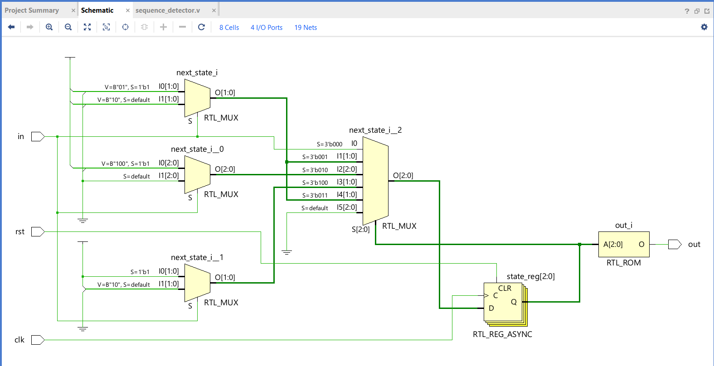
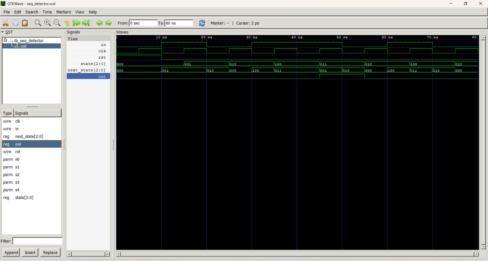

# Sequence Detector using FSM (Verilog HDL)

## Overview

This project implements a Finite State Machine (FSM) based Sequence Detector in Verilog HDL. The detector monitors a serial input stream and asserts the output whenever the target bit sequence is successfully detected. The design is implemented using separate state register, next-state logic, and output logic, making it a clean example of Moore FSM design.

The project has been functionally verified using an independent Verilog testbench and simulated with Icarus Verilog and GTKWave. The RTL schematic generated using Xilinx Vivado is also included to visualize the synthesized hardware architecture.

---

## Features

- Moore Finite State Machine (FSM)
- Five-state sequence detector
- Asynchronous active-high reset
- Separate state transition and output logic
- RTL schematic generated using Vivado
- Functional verification using testbench
- Simulation waveform generated using GTKWave

---

## FSM States

- **S0** – Initial/Idle state
- **S1** – First part of sequence detected
- **S2** – Second part of sequence detected
- **S3** – Third part of sequence detected
- **S4** – Complete sequence detected (Output = 1)

---

## Tools Used

- Verilog HDL
- VS Code
- Icarus Verilog
- GTKWave
- Xilinx Vivado

---

## Project Structure

- RTL Design
- Testbench
- RTL Schematic
- Simulation Waveform

---

## Learning Outcomes

- Finite State Machine (FSM) Design
- Moore Machine Implementation
- State Encoding
- Next-State Logic Design
- Sequential Circuit Design
- Verilog RTL Coding
- Testbench Development
- Functional Simulation
- RTL Schematic Interpretation

---

## RTL Schematic

---

## Simulation Results

