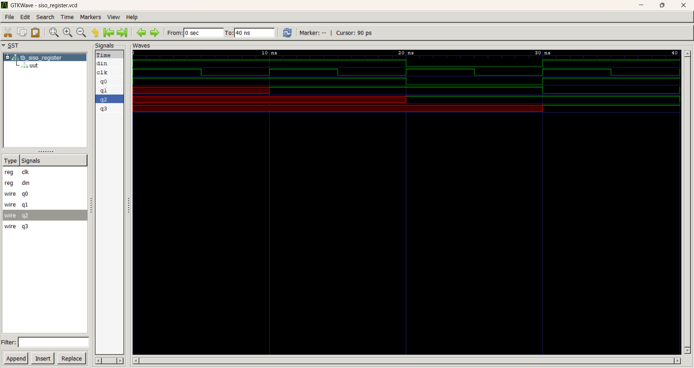
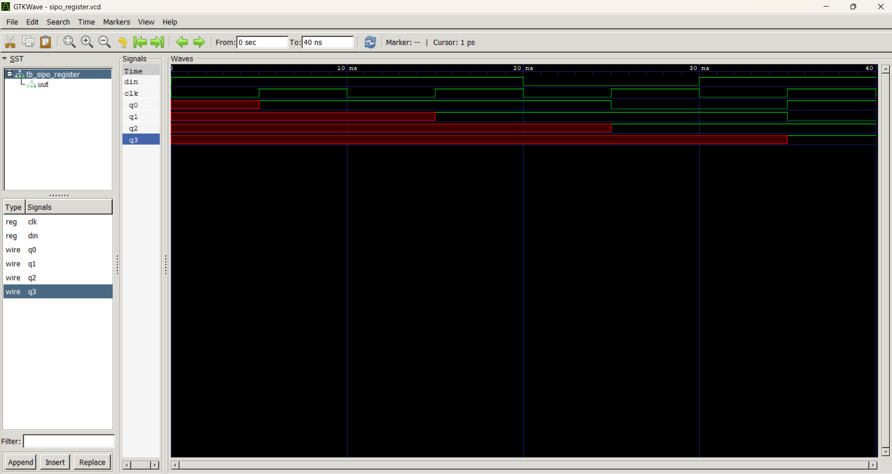
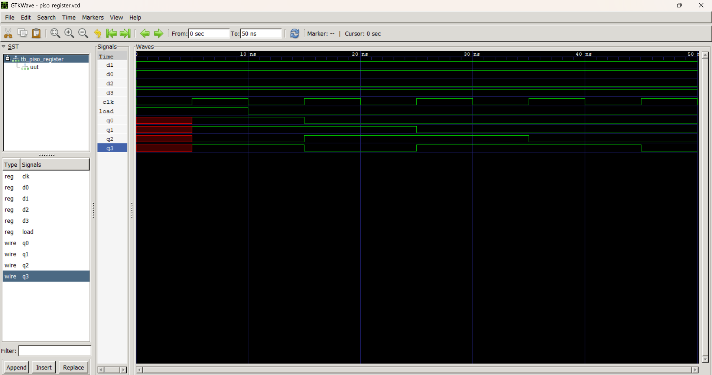
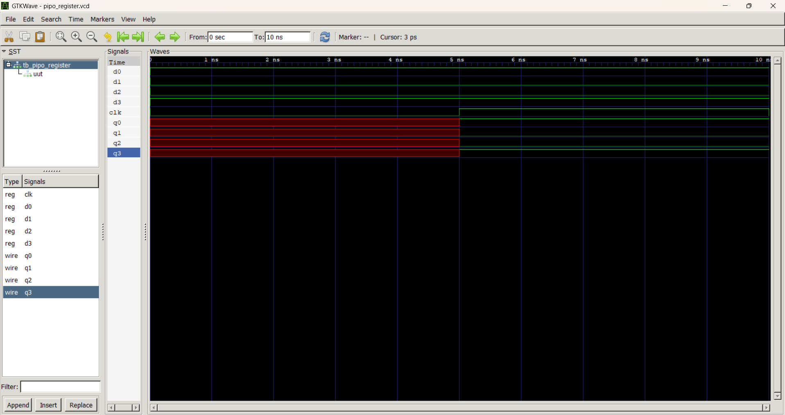

# Shift Registers in Verilog HDL

## Overview

This project implements the four basic types of shift registers using Verilog HDL. Each design is verified with an independent testbench and simulated using Icarus Verilog and GTKWave.

## Shift Registers Included

1. SISO (Serial-In Serial-Out)
2. SIPO (Serial-In Parallel-Out)
3. PISO (Parallel-In Serial-Out)
4. PIPO (Parallel-In Parallel-Out)

## Tools Used

- Verilog HDL
- VS Code
- Icarus Verilog
- GTKWave

## Project Structure

- SISO.v
- SIPO.v
- PISO.v
- PIPO.v
- Testbenches for each design
- Simulation waveforms

## Learning Outcomes

- Shift Register Design
- Sequential Logic
- Register Operations
- Verilog RTL Coding
- Testbench Development
- Functional Simulation

## Simulation Results

### SISO Register

### SIPO Register

### PISO Register

### PIPO Register

