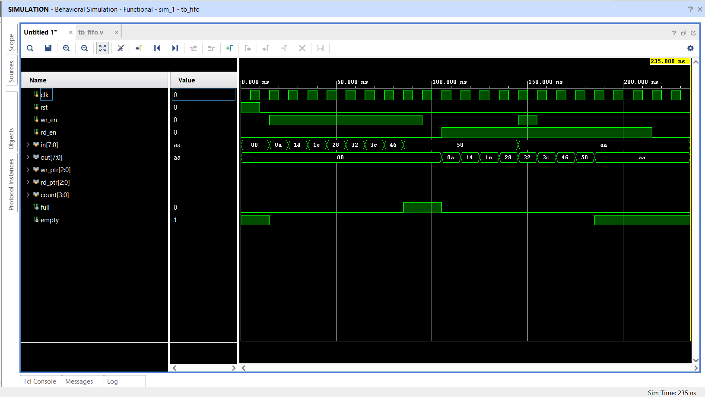
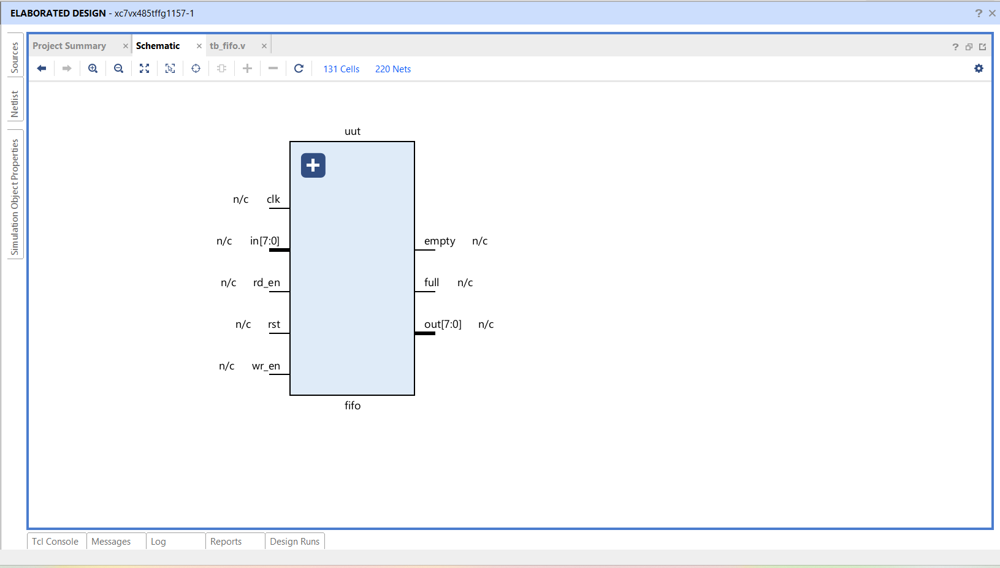
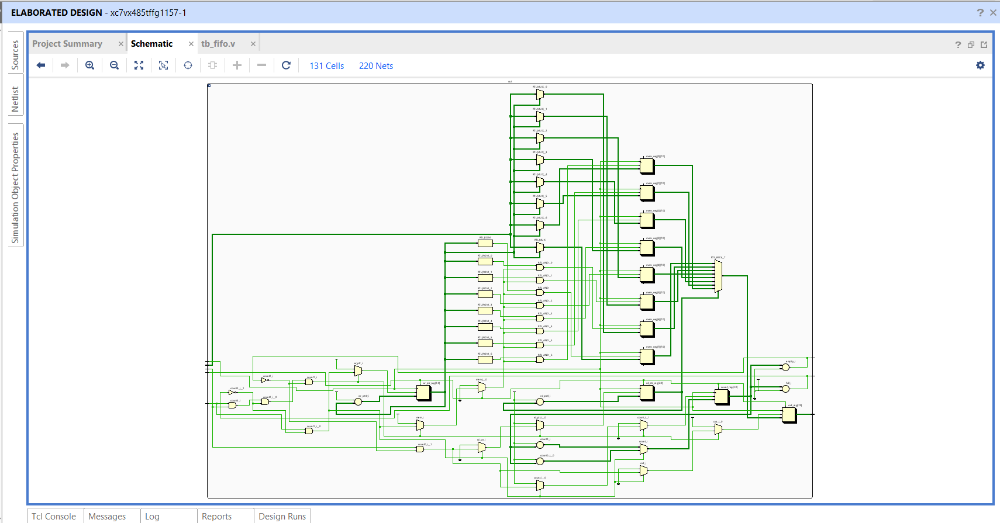

# Parameterized Synchronous FIFO in Verilog HDL

## Overview

This project implements a **parameterized synchronous FIFO (First-In, First-Out)** using Verilog HDL. The design supports configurable data width and FIFO depth through parameters, making it reusable for different applications. It includes full and empty flag generation, read/write pointers, and an occupancy counter to efficiently manage data storage.

The FIFO is verified using a dedicated testbench, simulated in both **Vivado** and **GTKWave**, and its RTL and elaborated schematics are generated using **Vivado**.

---

## Features

- Parameterized Data Width
- Parameterized FIFO Depth
- Synchronous Read and Write
- Read and Write Pointers
- Full and Empty Flag Detection
- Occupancy Counter
- Simultaneous Read and Write Support
- Vivado RTL & Elaborated Schematic
- Functional Verification using Testbench

---

## Working Principle

- Data is written into the FIFO when **wr_en** is asserted and the FIFO is not full.
- Data is read when **rd_en** is asserted and the FIFO is not empty.
- The write pointer advances after every successful write operation.
- The read pointer advances after every successful read operation.
- The occupancy counter tracks the number of stored elements and is used to generate the **full** and **empty** flags.
- Simultaneous read and write operations are supported while maintaining correct FIFO operation.

---

## Applications

- UART Communication
- SPI Communication
- DMA Controllers
- Data Buffering
- Producer-Consumer Systems
- Embedded Systems
- FPGA and ASIC Designs

---

## Tools Used

- Verilog HDL
- VS Code
- Icarus Verilog
- GTKWave
- Xilinx Vivado

---

## Project Structure

- RTL Design
- Testbench
- Vivado Simulation
- GTKWave Simulation
- RTL Schematic
- Elaborated Schematic

---

## Learning Outcomes

- Parameterized RTL Design
- Sequential Logic Design
- FIFO Architecture
- Pointer Management
- Memory Design
- Functional Verification
- Vivado RTL Analysis

---

## Simulation Waveform

---

## RTL Schematic

---

## Vivado Elaborated Schematic

