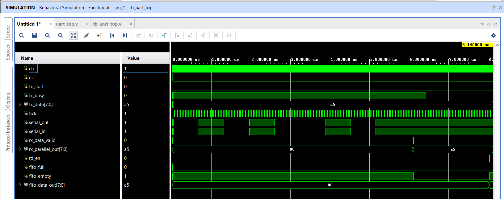
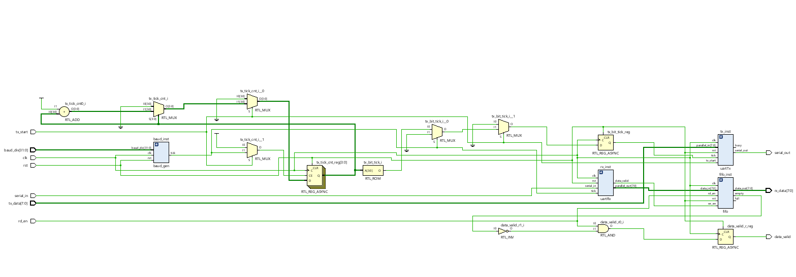
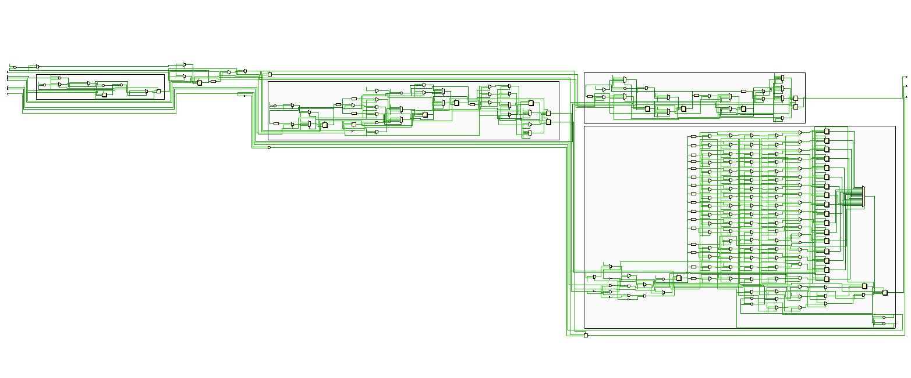
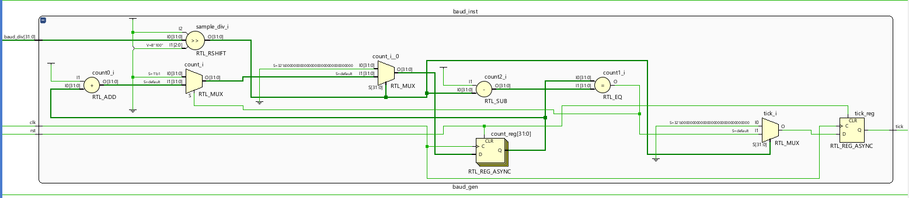
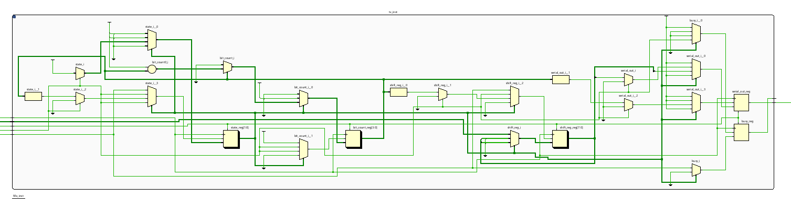
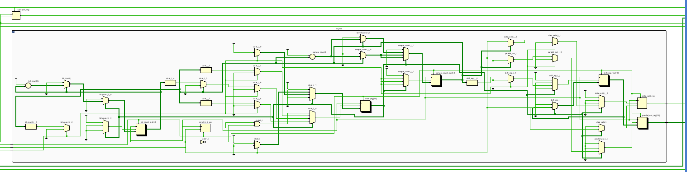
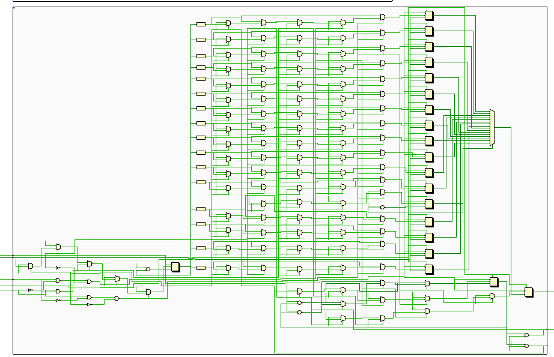

# UART IP Core in Verilog HDL

## Overview

This project implements a **UART (Universal Asynchronous Receiver Transmitter) IP Core** using **Verilog HDL**. The design provides reliable asynchronous serial communication by integrating a **Baud Rate Generator**, **UART Transmitter (TX)**, **UART Receiver (RX)**, and a **Synchronous FIFO** into a single reusable IP.

The project follows a modular RTL design methodology where each module is developed, verified, and integrated independently. This modular architecture simplifies debugging, improves code maintainability, and allows individual modules to be reused in future digital designs.

The complete UART IP has been functionally verified through simulation in **Xilinx Vivado**, and its architecture has been analyzed using **Vivado RTL Schematics**. This project demonstrates the complete RTL design flow, including RTL coding, module integration, functional verification, waveform analysis, and RTL visualization.

---

# Project Objectives

The primary objectives of this project are:

- Design a modular UART IP Core using Verilog HDL.
- Implement reliable asynchronous serial communication.
- Integrate multiple RTL modules into a complete communication subsystem.
- Verify the complete design through simulation.
- Analyze the RTL architecture using Vivado.
- Develop reusable RTL modules for future digital designs.

---

# Key Features

- Modular UART IP Architecture
- Baud Rate Generator
- UART Transmitter (TX)
- UART Receiver (RX)
- Synchronous FIFO
- UART Top-Level Integration
- Finite State Machine (FSM) Based Design
- Full Functional Verification using Testbench
- Vivado RTL Schematics
- Vivado Elaborated RTL Analysis
- Modular and Reusable RTL Design

---

# UART IP Architecture

The UART IP Core consists of the following modules:

- Baud Rate Generator
- UART Transmitter (TX)
- UART Receiver (RX)
- Synchronous FIFO
- UART Top Module

Each module performs a dedicated function while interacting with the top-level controller to provide complete UART communication.

---

# Module Description

## 1. Baud Rate Generator

The Baud Rate Generator divides the system clock to generate baud-rate timing pulses required for UART communication. These timing pulses synchronize both the transmitter and receiver, ensuring correct serial communication timing.

### Responsibilities

- Clock Division
- Baud Tick Generation
- UART Timing Synchronization

---

## 2. UART Transmitter (TX)

The UART Transmitter converts parallel input data into a serial data stream according to the UART protocol.

For every byte transmitted, the transmitter generates:

- Start Bit
- 8 Data Bits
- Stop Bit

The transmission process is controlled using a Finite State Machine (FSM) to ensure proper sequencing and timing of each transmitted frame.

### Responsibilities

- Parallel-to-Serial Conversion
- UART Frame Generation
- Serial Data Transmission

---

## 3. UART Receiver (RX)

The UART Receiver performs the reverse operation of the transmitter. It samples incoming serial data using the baud timing pulses, reconstructs the original parallel byte, and validates the received UART frame.

### Responsibilities

- Serial-to-Parallel Conversion
- UART Frame Detection
- Parallel Data Recovery

---

## 4. Synchronous FIFO

The FIFO acts as a temporary storage buffer for UART data. It allows smooth communication between modules by temporarily storing transmitted or received bytes.

The FIFO maintains:

- Write Pointer
- Read Pointer
- Occupancy Counter
- Full Flag
- Empty Flag

The design also supports simultaneous read and write operations while maintaining correct FIFO functionality.

### Responsibilities

- Temporary Data Storage
- Buffer Management
- Flow Control

---

## 5. UART Top Module

The UART Top Module integrates all UART submodules into a single communication IP Core.

It manages communication between:

- Baud Rate Generator
- UART Transmitter
- UART Receiver
- Synchronous FIFO

The top module coordinates overall data flow and represents the complete UART communication subsystem.

---

# Working Principle

The UART IP operates according to the following sequence:

### Step 1 — Baud Rate Generation

The system clock is supplied to the Baud Rate Generator. It divides the incoming clock frequency and generates periodic baud ticks used to synchronize UART communication.

### Step 2 — Data Buffering

Parallel input data is written into the Synchronous FIFO whenever write enable is asserted. The FIFO temporarily stores data until the transmitter is ready.

### Step 3 — Serial Transmission

The UART Transmitter reads data from the FIFO and converts each byte into a UART frame consisting of:

- Start Bit
- 8 Data Bits
- Stop Bit

The generated frame is transmitted serially through the TX line according to the baud-rate timing.

### Step 4 — Serial Reception

Incoming serial data is received through the RX line.

Using the baud timing pulses, the UART Receiver samples each incoming bit, reconstructs the original byte, and validates the received frame.

### Step 5 — Data Storage

The received data is stored inside the FIFO, allowing it to be read later whenever required.

### Step 6 — System Coordination

The UART Top Module coordinates all modules, manages data flow, and ensures synchronized operation between the Baud Generator, UART TX, UART RX, and FIFO.

This modular architecture improves readability, simplifies verification, and allows each RTL module to be reused independently in future communication systems.

---

# Applications

This UART IP can be integrated into a variety of digital communication systems, including:

- Embedded Systems
- Microcontroller Communication
- Serial Communication Controllers
- ASIC Digital Designs
- FPGA-Based Digital Designs
- Sensor Interfaces
- Industrial Automation
- Data Acquisition Systems
- Debug Interfaces
- IoT Communication Systems

---

# Tools Used

- Verilog HDL
- Xilinx Vivado
- VS Code
- Icarus Verilog
- GTKWave

---

# Project Structure

```text
UART-IP/
│
├── rtl/
│   ├── baud_generator.v
│   ├── fifo.v
│   ├── uart_tx.v
│   ├── uart_rx.v
│   └── uart_top.v
│
├── testbench/
│   └── tb_uart_top.v
│
├── images/
│   ├── uart_top_simulation_waveform.png
│   ├── uart_top_rtl_schematic.png
│   ├── uart_top_expanded_rtl_schematic.png
│   ├── baud_generator_rtl_schematic.png
│   ├── uart_tx_rtl_schematic.png
│   ├── uart_rx_rtl_schematic.png
│   └── fifo_rtl_schematic.png
│
└── README.md
```

---

# Learning Outcomes

Through this project, the following concepts were implemented and verified:

- RTL Design Methodology
- Modular Digital Design
- UART Communication Protocol
- Finite State Machine (FSM)
- FIFO Architecture
- Clock Division Techniques
- Functional Verification
- Simulation-Based Debugging
- RTL Schematic Analysis
- Digital System Integration

---

# Simulation Result

## UART Top Simulation Waveform



---

# RTL Schematics

## UART Top RTL Schematic



---

## UART Top Expanded RTL Schematic



---

# Individual Module RTL Schematics

## Baud Rate Generator



---

## UART Transmitter



---

## UART Receiver



---

## Synchronous FIFO



---

# Conclusion

This project demonstrates the complete RTL design and functional verification of a modular UART IP Core using Verilog HDL. By integrating a Baud Rate Generator, UART Transmitter, UART Receiver, and Synchronous FIFO into a unified top-level architecture, the project showcases practical skills in digital design, RTL development, module integration, simulation-based verification, and RTL analysis using Xilinx Vivado. It represents a strong portfolio project for RTL Design, Digital Design, FPGA Design, and ASIC Design roles.
